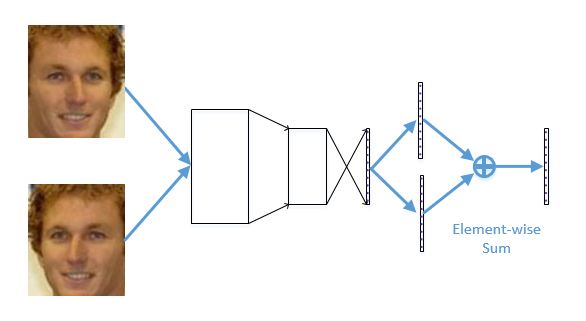

# Mirror Face

It seems that many friends are curious about the mirror face trick. I am writing this technical report to describe it with more details.

Mirror face is (one of) the most effective prior for face image analysis. 
It extracts features from the frontal face and mirror face simultaneously and merge the two features together as the final feature. A sample network is in [./prototxt/example_of_mirror_face.prototxt](https://github.com/happynear/NormFace/blob/master/prototxt/example_of_mirror_face.prototxt).

Mirror face can be trained in an end-to-end manner.
However, I find it has no help on **training** face verification models.
It can improve the performance of face identification, but when I applied it on face verification, the accuracy even decreased:(

Here are the accuracies using [Wen's model](https://github.com/ydwen/caffe-face) with different feature merging strategy.
We didn't put these tables into our paper because we thought this was only a trick.

| PCA? | Front only  | Concatenate | Element-wise SUM | Element-wise MAX |
| ---- |:-----------:|:-----------:|:----------------:|:----------------:|
| No   | 98.5%       |98.53%       |98.63%            |98.67%            |
| YES  | 98.8%       |98.92%       |98.93%            |98.95%            |

With my model:

| PCA? | Front only  | Concatenate | Element-wise SUM | Element-wise MAX |
| ---- |:-----------:|:-----------:|:----------------:|:----------------:|
| No   | 98.77%      |99.03%       |99.02%            |99%               |
| YES  | 98.96%      |99.17%       |99.2167%          |99.2167%          |

And with [Wu's Light CNN B](https://github.com/AlfredXiangWu/face_verification_experiment):

| PCA? | Front only  | Concatenate | Element-wise SUM | Element-wise MAX |
| ---- |:-----------:|:-----------:|:----------------:|:----------------:|
| No   | 98.10%      |98.35%       |98.42%            |98.35%            |
| YES  | 98.41%      |98.63%       |98.61%            |98.63%            |

With my model:

| PCA? | Front only  | Concatenate | Element-wise SUM | Element-wise MAX |
| ---- |:-----------:|:-----------:|:----------------:|:----------------:|
| No   | 98.48%      |98.73%       |98.78%            |98.78%            |
| YES  | 98.45%      |98.55%       |98.65%            |98.62%            |

It's strange that with my C-contrastive loss, the performance of `No PCA` is better... Anyway, in Wu's paper, he didn't use PCA either. So there is nothing wrong with what I said in my paper: "I follow all the experiment settings of the original paper".

To sum up, the mirror face trick is effective on most of models (actually I never see cases that mirror face does not work). However, we are lacking of theoretical explanation for it. Now we can only explain it as model ensemble. Whether to use SUM or MAX, how to train it end-to-endly in face verification models, these are still open problems. Hope this report can inspire people to do further research.
